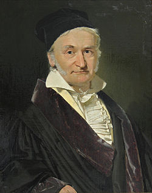

# The Number Theory Scrapbook

## File Structure
```
number-theory-scrapbook/
├── index.html   ← All screens / sections
├── style.css    ← Dark emerald theme
├── app.js       ← Navigation, topic routing, next topic/mystery, glossary filter
├── paper.pdf    ← ADD YOUR OWN — research paper for the "More" screen
└── README.md
```

## Screens
| Screen ID | Nav Label | Description |
|---|---|---|
| `home` | Home | Title, Begin Learning button, 4 overview rows, Founding Fathers |
| `learn` | Learn | Syllabus with clickable topic cards |
| `topic-detail` | — | 4-quadrant layout + Next Topic button |
| `glossary` | Glossary | Searchable, categorized term cards |
| `mysteries` | Mysteries | 2-exhibit gallery |
| `mystery-detail` | — | 4-quadrant layout identical to topic detail |
| `more` | More | PDF viewer |
| `references` | References | Textbooks, courses, websites |
| `about` | About | About you + notebook pages |

## Adding Your Content

### Home page
- Replace `[ Your content goes here ]` inside each `.overview-block` with your text.
- Replace `[ Image placeholder… ]` divs with `` tags pointing to your images.

### Mathematician portraits
Images are loaded from Wikimedia Commons. If your browser blocks them, the italic letter monogram shows instead. To use local images:
```html

```

### Topics (4-quadrant pages)
In `app.js`, inside `openTopic()`, replace the placeholder strings in:
- `td-theory` — LaTeX theory (`$...$` inline, `$$...$$` display)
- `td-viz` — diagram HTML or `` tag
- `td-practice` — problem/solution blocks
- `td-application` — paragraph + app-tags

### Next Topic button
Automatically populated based on the `TOPICS` array order in `app.js`.
When the last topic is reached, it switches to "Back to Syllabus."

### Mysteries
In `app.js`, update the `MYSTERIES` array with real names/proposers.
Inside `openMystery()`, replace placeholder strings for theory, viz, known results, and significance.
The "Next Mystery →" button works the same as Next Topic.

### Glossary
In `index.html`, fill in `.g-def` for each `.glossary-card`.
To add more cards, copy a card block and set `data-cat` to one of:
`foundations` | `congruences` | `functions` | `primes` | `advanced`

### Research Paper
1. Place `paper.pdf` in this folder.
2. In `index.html` → `#more`, delete the placeholder `<div class="pdf-viewer-area">...</div>`.
3. Uncomment the `<iframe>` block directly below it.

## KaTeX
Use `$...$` for inline math and `$$...$$` for display math anywhere in the HTML.
KaTeX re-renders automatically on every screen transition.

## Deploy to GitHub Pages
Push the folder to GitHub → Settings → Pages → main / root.
No build step needed — plain HTML/CSS/JS.
